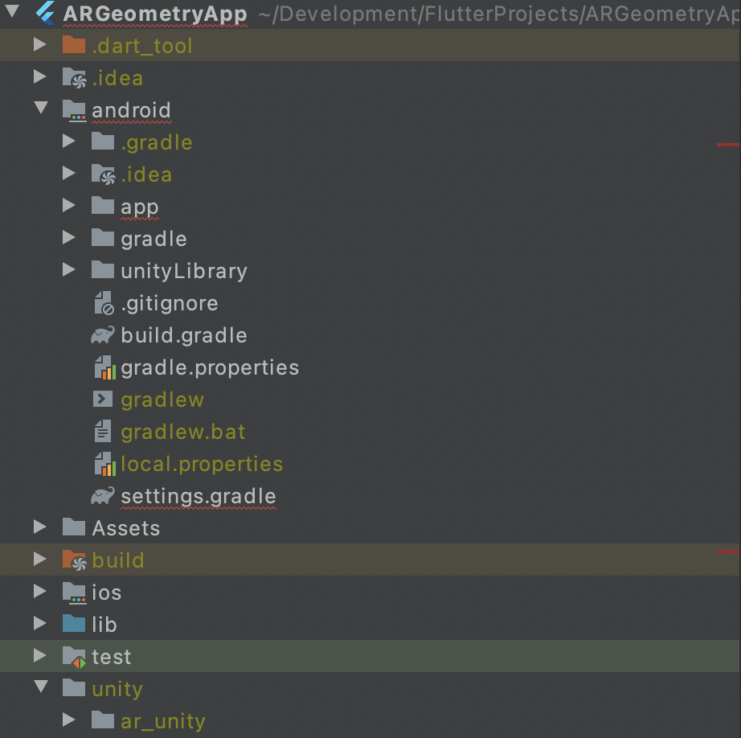

# argeometry

A new Flutter project.

## Getting Started

This project is a starting point for a Flutter application.

A few resources to get you started if this is your first Flutter project:

- [Lab: Write your first Flutter app](https://flutter.dev/docs/get-started/codelab)
- [Cookbook: Useful Flutter samples](https://flutter.dev/docs/cookbook)

For help getting started with Flutter, view our
[online documentation](https://flutter.dev/docs), which offers tutorials,
samples, guidance on mobile development, and a full API reference.

### Method to run this :

Since after building the Flutter project, a lot of files are being generated whose cumulated size is beyond 1 GB.
I am unable to track them individually. So, here is what you need I have planned to do:

1. Pull the project from origin master
2. Download the unity project and unzip and place it under the folder named `unity`
3. Download the unityLibrary zip and unzip and place it under `android` folder

Here is how it should look after the above steps are completed.

### Method to build for release and avoid the black AR Screen

The AR Screen in the build apk might be black although it is working in the debug mode.
The solution involves two steps:

1. Add the following lines in android/unityLibrary/proguard-unity.txt

`-keep class com.unity3d.plugin.* { *; }
 -keep class com.xraph.plugins.flutterunitywidget.UnityUtils { *; }`
 
2. Add the following line before the `application` tag starts in android/app/src/main/AndroidManifest.xml

`<uses-permission android:name="android.permission.CAMERA" />`

### Link to the google drive folder to download the resources

https://drive.google.com/drive/folders/1wLYuLjvENwBPYbO9AKBBCUbyuy-cp2hm?usp=sharing